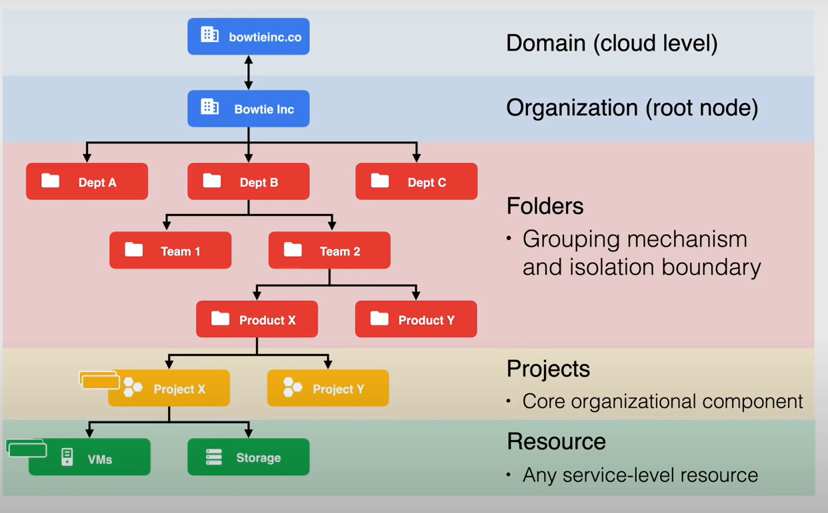

# Google Cloud Associate Certification Preparation - antony’s course

## Cloud computing fundamentals

- What is cloud computing?
    
    delivery of shared pool of on demand computing services over the public internet , that can be rapidly provisioned and released with minimal managment effort or service provider interaction
    
- What are the characteristics of a cloud?
    - on demand self service
    - broad network access
        - available over network
    - Resource pooling: pooled resources to support multi tenant model
    - rapid elasticity
    - measured service: pay for what you use
- What are cloud deployment models?
    - what is public cloud ?
        - computing services offered by third party providers that can be accessible over the internet
        - example : gcp, aws, azure
        - public clouds can be used together to form multi-cloud model
    - what is private cloud ?
        - refers to the architecture that exists on premise and it is not accessible through the internet
        - restricted to the bussiness itself
        - for example
            - Anthos
            - Aws outposts
            - azure stack
    - what is hybrid cloud ?
        
        combination of private and public cloud
        
- cloud deployment models resume
    
    Public Cloud - 1 public cloud ( gcp ,aws ,azure ,…)
    
    Multi cloud - 2 or more public clouds
    
    Private CLoud - on-premise cloud
    
    Hybrid Cloud - private cloud + public cloud
    
- What are cloud service models?
    
    commonly refered to as zas (XaaS) : anything as a service
    
    - what is IaaS ?
        
        Infra as a service: is a cloud service model where your manage only application, data, runtime, container ,and the operating system
        
    - what is PaaS ?
        
        Platform as a service: is a cloud service model where your manage only application, data
        

## Google Cloud Fundamentals

- What is a zone?
    - deployment area for google cloud resources within a region
    - smallest entity in google’s global network
    - a single failure domain within a region
    
    <aside>
    💡 best practices: always deploy resources in zones closer to users for optimal latency
    
    </aside>
    
- What is a region?
    - independent geographic areas that are sub-divided into zones
    - having region with multiple zonnes is a great choice for fault tolerance and high availability intercommunication <5ms between zones within a region
- What is a multi-region?
    - large geographic areas that contains one or more regions
    - allows to maximise redundancy and distribution
    - high availability ( geo-redundant )
- What is a compute engine?
    - google cloud service that offers virtual machines of vms called instances
    - we can deploy it to a specific region and zone
    - we have the flexiblity to choose the os and the softwares we want to run in the vm
    - we can use public or private images to create instances
    - we can also install packages or software pre configured using google cloud marketplace
    - we can manage multiple instances using `instance groups`
    - we can scale up or down using the autoscaling with instance groups
    - we can attach/detach disks as needed
    - we can use gcs as a storage
    - we use ssh to connect to these instances
- What is GKE?
    
    google kubernetes engine: container orchestration system that is built on top of opn source kubernetes that allows the automate deployment, scaling, and managing containers
    
    - flexibility to integrate with on prem k8s
    - uses compute engine as nodes in a cluster
    - a cluster is group of nodes or compute engine instances
- What is an App Engine?
    - fully managed, serverless platfomr for developing and hosting web apps at scale (PaaS)
    - provisions servers and scales your app instances based on load
    - we can use any language such as : Go, Python, .net nodes.js, php, ruby
    - we focus only on the code and google manage the other things for us
    - can be integrated with google services seamlessly
    - can also be integrated with Web Sec Scanner for identifying issues or threats
- What are cloud functions?
    - serveless execution environment for building and connecting cloud services
    - simple , single purpose functions that are attached or triggered by events
    - when an event that is being watched is fired then the cloud function will be executed
    - the code will be executed in a fully managed environment
    - we can use Go, Python3 , or Java to write code
    
- What are some use cases for cloud functions?
    - data processing or ETL operations
    - webhook to respond to http triggers
    - APIs that compose loosely coupled logic
    - mobile backend functions
    - FaaS
- What is cloud computing?
    - fully managed compute platform for deploying , and scaling containerized apps quickly and securly
    - built on top of knative
    - abstracts away all infrastructure management
    - known as serverless for containers
    - considered as FaaS
- What is cloud storage?
    - consistent , large capacity, highly durable, object storage
    - not the type of storage you will attach to your vms that will hold os
    - a storage that will be used to manage data as object
    - has 11 9’s durability
    - unlimited storage
    - use cases: content delivery, data lakes, and backup
    - available in different storage classes and availability
- What are storage classes?
    
    a storage classe is a piece of metadata that is used by every object, the storage classse affects the objects availability and pricing model
    
    | Standard | Nearline | Coldline | Archive |
    | --- | --- | --- | --- |
    | Maximum availability | low cost archival storage | Even lower cost archival storage | lowest cost archival storage |
    | No limits | Accessed < 1/mo | Accessed < 1/qtr | Accessed < 1/yr |
    
    `Availability`
    
    - Region
    - Dual-Region
    - Multi-Region
- What is Firestore?
    - fully managed `NFS : Network file system` file server
    - NFSv3 compliant
    - store data from running apps
    - use with vm instances and k8s clusters
- What are persistent disks?
    - durable block storage for instances
    - we have two options
        - `Standard`
            - regular  standard storage at a reasonable price
        - `SSD`
            - lower latency
            - higher iops
        - Standard and SSD are available in zonal and regional options
- What are the two Relational database options?
    - Cloud SQL
    - Cloud Spanner
    - `comparison`
    
    | Cloud SQL | CLoud Spanner |
    | --- | --- |
    | fully managed db service | scalable relational database service |
    | postgresql , mysql and sql server | support transcations, strong consistency and synchronous replication |
    | high availability across zones | high availabiltitty across regions and globally |
- What are the NOSQL options?
    
    
    | Bigtable | datastore | Firestore | MemoryStore |
    | --- | --- | --- | --- |
    | fully managed, scalable, nosql database | fully managed ,serveless nosql document database | NoSQL, realtime database | highly available in memory service for Redis and memcached |
    | high throughput with low latency | for mobile, web, and Iot apps | optimized for offline use | fully managed |
    | cluster resizing without downtime | multi region replication & ACID transactions | cluster resizing without downtime |  |
- What is a VPC?
    
    `VPC`: Virtual Private Cloud
    
    is a virtualized network within google cloud 
    
    - core networking service
    - global resource
    - each vpc contains a default network
    - we can create additional networks in the project, but networks cannot be shared between projects
- What are firewall rules?
    - control traffic coming into instances in a network
    - default network has a default set of firewall rules
    - custom rules can be created
- What are the routes?
    - how traffic should be routed to your vpc
    
    - specifies how packets leaving an instance should be directed
- What is http load balancing?
    - Distribute traffic across regions
    - ensure traffic is routed to the closest healthy instances in the event of failure or over capacity
    - distribute traffic based on content type
- What is network load balancing ?
    - regional load balancer
    - distribute traffic among instances in the same region based on IP protocol data, such as address, port , and protocol
- What is Google Cloud DNS?
    - a service that allows publishing dns recorrds by using the same infra that google uses
    - work with managed zones and dns records through the CLI API or SDK
- What are some advanced connectivity options in Google Cloud?
    - what is direct interconnect ?
        - connect an existing network to your vpc using a highly available, low latency, enterprise-grade connection
    - what is cloud vpn ?
        - connect your existing network or on prem network to your vpc through an IPSec connection
    - what is direct peering
        - allow traffic to flow to google’s edge network location and pairing can be done directly
    - what is carrier peering ?
        - allow traffic to flow to google’s edge network location and pairing can be done directly
        - peering will be done through a service provider

## Accout Setup

- What is the resource hierarchy?
    
    a resource in gcp can refered to  service level resource that is used to process your workloads such as vms, cloud sql, cloud storage buckets
    
    `resource hierarchy`: is a google way to configure and grant access to the various resources
    
    - resources are organised using parent/child relationship
    - designed to map org strucutre to google cloud
    - policies are controlled by IAM
    - Access control policies and configuration setting on a parent resource are inherited by the child
    - each child object has exaclty one parent
    - the org is the root node
    - folders can have folders
    - each folder should have exactly one parent
    - a resource can be linked to only one project
    - labels are used to categorize resources
    
    
    
- What is a billing account?
    - cloud level resource that defines who pay for a given seet of goolge cloud resources
    - tracks all cost incurred by google cloud usage
    - linked to a payments profile
    - can be linked to one or more projects
    - has specific roles and permissions to control access
    - cloud billing is offered in two different account types :
        - `self service`
        - `Invoiced (offline)`
    - sub accounts cana be used for resellers
    - ownership of a cloud billing account is limited to one org, but we can use a cloud billing account in org x to pay for resources in org y
    - 
    
    
    
- What is a payment profile?
    - google level resource managed at `payments.google.com`
    - processes payments for all google services such as google ads and not only google cloud
    - stores all payment methods
    - single pane of glass for viewing invoices and payment history
    - controls who can view and receive invoices
    - individual or Business profile types cannot be changed
- What are the tools used to interact with GCP?
    - gsutil
    - gcloud
    - bq (big query)
    - kubectl
- How do we authorize cloud SDK tools?
    - through providing a
        - user account
            - for single machine it’s a best practice
        - service account
            - for multiple machines
- What is the `gcloud init` command?
    
    used to initialise, authorise and perfom extra setup steps
    
- What is the `gcloud auth login` command?
    
    authorise access for gcloud 
    
- What is the `gcloud config` command?
    
    allows you to configure accounts & projects
    
- What is the `gcloud components` command?
    
    allows you to install, update & delete sdk components
    
- What is the gcloud command format?
    
    `gcloud component entity operation positional-args flags`
    
    example: gcloud compute instances create example-instannce-1 —zone=us-central1-a
    
- How do I revoke the credentials for the active account?
    
    ```yaml
    gcloud auth revoke
    ```
    
- How do I set up a specific account?
    
    ```yaml
    gcloud config set acount xyz@gmail.com
    ```
    
- What is the command used to set a project, zone, or region?
    
    ```yaml
    gcloud config set 
    ```
    
- How do I list GCloud components?
    
    ```yaml
    glcoud components list
    ```
    
- How do I install a specific component?
    
    ```yaml
    gcloud components install [COMPONENT_NAME]
    ```
    
- How do I update all the components?
    
    ```yaml
    gcloud components update
    ```
    
- how to list instances in -east1-a
    
    ```yaml
    gcloud compute instances list --filter="zone:(us-east1-a)"
    ```
    
- What are limits and quotas?
    
    limit how much of a particular google cloud resource your project can use
    
- What types of quotas are available?
    - rate quota
        - resets after a period of time
    - allocation quota
        - must be explicitly released
- Why are quotas enforced?
    - protect other cloud users
    - helps with resource managment
    - countable
        - each quota limit is expressed in terms of a particular countable resource
- How do we monitor quotas?
    - we can use cloud monitoring api and ui
    - we can use these monitoring metrics to create dashboads and alerts when we reacah quota limit
- How long does it take for a quota limit to be reflected in GCP?
    
    up to 24h
    
- What is the status code that Google Cloud will return if you exceed the quota limit?
    - 429 if using http or ResourceExhausted if using grpc
- How do we view quotas?
    - api dashboards
    - using quotas pagp

## ☁️ Identity and Access Management

### Cloud IAM

- What is the principle of least privilege?
    
    a user , a program, or process should have only the bare minimum privileges necessary to perform its function
    
    
    
- What is IAM?
    - Identity Access Managment
    - defines who (identity) can do what (roles) on which resources
    - permissions aren’t granted directly to the end user but rather, the permissions are grouped into roles and then granted to authenticated user
- What is a member?
    - identity that can access a resource
    - email address associated with a `user`, `service account`, `google group` or even a `domain name` associated with a g suite or cloud identity domains
- Explain the member types available in IAM.
    - Google Account
        - any email address that’s associated with a [gmail.com](http://gmail.com) or other domains
    - Service Account
        - an account that will be used by applications to perofms its tasks
    - Google Groups
        - a named collection of google accounts and service accounts
    - G Suite Domain
        - Google Accounts that have been created in an org’s G Suite account
    - Cloud Identity Domain
        - Google Accounts in an org that are not tied to any G suite apps or featues
    - AllAuthenticatedUsers
        - special identifier for users authenticated with a google account
    - AllUsers
        - all users on the internet
- What is a role?
    
    role is a group of permissions that allows perfom a specific function in gcp
    
- What are permissions?
    - determine which action is allowed on a resource
    - **not granted directly to users ❗**
    - example
        - compute.instances.get
- What are the role types in IAM?
    
    
    
    - we cannot create custom roles at the folder level ( but we can define the custom role on the parent of that folder )
    - the custom roles user interface is only available to users  who have permissions to create or manage custom roles
    - always check if you can use a specific permission when creating a custom role
    - custom roles have launch stages
        - alpha: in testing
        - beta: tested and waiting approval
        - ga: generally available

### Policies and Conditions

- What is a policy?
    - a collection of bindings , metadata & audit configuration
    - binding:
        - binds one or more members with a single role and any contact specific conditions that change how and when the role is granted
    - metadata:
        - includes additional information about the policy such as an etag and version to facilitate policy management
    - audit configurations:
        - specify the configuration data of how access attempts should be audited
    
    
    
- What is a condition?
    - used to define conditional access contol for google cloud resources
    - condititons allow to choose granting resource access to identities only if configured conditions are met
- What are metadata etags?
    - used to handle concurrency when updating a policy in the same time
- What is an audit configuration?
    
    used to specify which permissions are logged and what are not , as well as which identities are exempted from logging
    
    
    
- What is the purpose of versions in policies?
    - version 1: no condition statement
    - version 2: for google use
    - version 3: introduces conditions
- What are the policy limitations?
    - each resource can have 1 policy
    - 1500 members or 250 google groups per policy
    - up to 7 minutes for policy to fully propagate across GCP
    - limit of 100 conditional role bindings per policy
- Conditions attributes can be based on what?
    - timestamp
    - originating/destionatin IP address
- some limits to conditions?
    - conditions are limited specific services
    - Primitive roles are unsupported
    - members cannot be allUsers or allAuthenticatedUsers
    - Limit of 100 conditional role bindings per policy
    - 20 role bindings for same role and same member
- What is the command to grant a user the role of storage admin?
    
    ```yaml
    gcloud projects set-iam-policy-binding [PROJECT_ID] --member user:xyz@org.tld --role roles/storage.admin
    ```
    

### Service Accounts

- What is a service account?
    
    is an non human identities used by apps and vms to access google cloud apis and the different resources
    
    
    
    sa is a resource which has iam policy attached to it , so a user can have the editor role on a sa , and another user will have the viewer role on the same sa
    
- What are the types of service accounts?
    - User managed
        - the service accounts you create
        - you choose the name
        - up to 100 limit
        - what is the format of user managed service account ?
            
            ```yaml
            service-account-name@project-id.iam.gserviceaccount.com
            ```
            
    - Default
        - when you use some gcp services it creates user managed service accounts
        
        <aside>
        💡 google recommends to create custom service accounts for prod
        
        </aside>
        
        <aside>
        💡 google recommends to disable the automatic granting of roles through the use of a policy or manually
        
        </aside>
        
        - automatically grants the editor role for the project
        - what is the format of default SA ?
            
            ```yaml
            project-id@appspot.gserviceaccount.com => any sa created by app engine
            project-number-compute@developer.gserviceaccount.com => for compute engine
            ```
            
    - Google Managed
        - managed by google
        - they are used by google services
        - not all of them are visible
        - name ends with “Service Agent” or “Service Account”
        
        <aside>
        ⚠️ it is not recommended to revoke or change the roles granted to google managed sa
        
        </aside>
        
- What are the two types of SA keys?
    
    
    | Google Managed | User Managed |
    | --- | --- |
    | Key managment handled by google | key storage |
    |  | key revocation |
    |  | key rotation |
    |  | key recovery |
- What is service account impersonation?
    
    when a person act as a sa to access google cloud services
    
- What is an access scope?
    
    legacy method of specifying permissions in google cloud
    
    used to limit the access of a service account
    
    by default , default sa will refer to the legacy method which is specify scopes
    
    but for custom sa we can use IAM roles instead of access scopes
    
- how a sa is used ?
    - first method: attach the sa to a resource
    - second method : impersonate the sa
- What are some best practices for using Service accounts?
    - Audit service using serviceAccount.keys.list() method or the logs viewer page in the console
    - delete service account external keys if you don’t need them
    - grant the sa only them min of permissions necessary to achieve it’s goal
    - create a service account for each service with the only permissions required for that service
    - take advantage of the IAM service account API to implement key rotation
- How do I check the identity used to run the commands using gcloud?
    
    ```yaml
    gcloud config list
    ```
    
- Can you change a service account on a VM without stopping it?
    
    no
    
- How do I list service accounts in an account?
    
    ```yaml
    gcloud iam service-accounts list
    ```
    
- How to create an ANN SA using GCloud
    
    ```yaml
    gcloud iam service-accounts create service-account-iam --display-name='sa-tonybowtie'
    ```
    
- How do I assign permissions to a service account?
    
    ```yaml
    gcloud projects add-iam-policy-binding [policy_name] --member 'serviceAccount:sa-tonybowtie@project-id.iam.gserviceaccount.com' --role 'roles/storage.objectViewer'
    ```
    

### Cloud Identity

- What is cloud identity?
    - Identity as a Service (IDaaS) solution
    - allows to centrally manages users and groups
    - provides many features : device managment , security , Single Sign-on (SSO), Reporting, Directory management
- What is device management?
    
    allows users to use their mobile devices to access org data securly  
    
- What is the Security component of cloud identity?
    
    provides 2SV or two step Verification , requires users to verify their identities through something they know such as the password + a passcode or google prompt … 
    
- What is single sign-on (SSO)?
    
    SSO allows users to access multiple apps or systems wihout authenticating multiple times
    
- What is Reporting in cloud identity?
    - covers audit logs for devices , tokens
    - we can export logs to bigquery for data analysis
    - we can create dashboards
    
- What is directory management?
    
    providers profile informations 
    
    we can synchronise data with azure active directory through GCDS (google cloud directory sync)
    

### Cloud IAM Best Practices

- least privilege principal
    - apply only the minimum access level required for what’s needed
- Use predefined roles instead of primitives.
- grant roles at the smallest scope
- child resources cannot restrict access granted to their parents ( always check resource hierarchy)
- restrict who can create and manage service accounts
- be cautious with owner roles( grant editor rather than owner)
- mirroring your google cloud resource hierarchy to your organization structure
- use projects to group resources that share the same trust boundary
- set policies at the organization level and at the project levelrather than at resource level
- grant roles for users or groups at the folder level instead of setting it at the project level if they span across multiple projects
- when using service accounts, treat each app as a separate trust boundary
- do not delete any service accounts that are being used by running services
- be sure to rotate keys
- reflect service account keys to reflect use and permissions
- restrict service account access (only give the SA to those who need it).
- don’t check in service account keys into source code

********************************Policy managment********************************

- grant access to all projects in your org , use an org level policy
- grant roles to a google group instead of individual users where possible
- when granting multiple roles to a particular task, create a google group instead

## ☁️ Networking Services

- What is VPC?
    - what is virtual private cloud , a virtualized network within google cloud , vpc allows the creation of networks in the cloud to use it for resources
    - vpc is a global resource
    - encapsulated within a project
    - vpc’s do not have any IP address rangges associated with them
    - traffic can be controlled using firewall rules
    - resources within a vpc can communicate with one another by using internal (private) IPv4 addresses otherwise the traffic must traverse the public internet or we can use vpc peering or by using cloud vpn
    - vpc networks support ipv4 traffic
    - each vpc contains a default network
    
     
    
- What are the two network types in a VPC?
    - Auto Mode
        - subnets will be created in each region automatically
        - can be converted to custom mode
    - Custom Mode
        - full control over subnets
        - subnets must be created manually
        - better suited for prod
        - google recommends using custom mode
- Can two VMs, each of which is in a specific region within the same VM, communicate?
    
    yes
    
- Can two VMs that aren’t on the same VM communicate?
    
    no
    
- How do I make the IP address range bigger?
    
    ```yaml
    gcloud compute networks subnets expand-ip-ranges [NETWORK_NAME] --region=[REGION]
    ```
    
- What is a VPC network subnet?
    - a subnetwork of a VPC
    - each VPC network consists of one or more subnets and each subnet is associated with a region
    - the name or region of a subnet cannot be changed after you have created it
    - primary and secondary ranges for subnets cannot overlap with any allocated range
- What are the limits of increasing subnet IP space?
    
    Must not overlap with other subnets in the same vpc network  
    
    network range must be larger than the original
    
    once a subnet has been expanded you cannot undo it 
    
- What are the IP addresses that you cannot use inside Google’s network?
    - network address : first address
    - Default gateway: Second address
    - Second to last address- Google cloud future use
    - Broadcast - last address
- What are the routes?
    - routes define the network traffic path from one destination to the other
    - in a vpc routes consists of a single destination and a single next hop
    - all routes are stored in the routing table
    - each packet leaving a vm will be delivered to the next hop of an applicable route based on a routing order
- What are the two routing types available in GCp?
    - System generated
        - default
            - path to the internet
            - path for private google access
            - if you want to isolate your network you can delete this default route by replacing it with custom route
            - has the lowest priority
        - subnet route
            - routes that define path to each subnet in the vpc
            - each subnet has at least one subnet route whose destination matches the primary IP range of the subnet
            - when a subnet is created a corresponding subnet route is created for both primary and secondary
    - Custom routes
        - static routes
            - can use the next  hop feature
            - can be created manually
        - dynamic routes
            - managed by one or more cloud routers
            - dynamically exchange routes between a vpc and on prem, destionation ip ranges outside the VPC network
            - used with dynamically routed vpns and interconnect
- What is private Google access?
    - vms that uses only internal ip addresses can use the private google access which allow them to reach google apis and services
    - if you disable private google access the vm won’t reach the google apis and services
    - private google access has no access on instances that have external ip address and can access the internet
- What are the types of internal IP addresses?
    - Auto
        - the address comes from a region subnet
    - Custom
        - you must specify which subnet the IP comes from
    - Alias IP
    - All Subnets have a primary IP range , but we have the possibility of adding a secondary range, and we can create alias IP that can be assigned from the primary or secondary ranges
- What is an alias IP?
    
    we can use it to configure multiple ip addresses for a vm, useful when we have multiple services or containers in the same vm and we want each service to have a different IP 
    
- What are the two modes that we can use for IP addresses, either auto or custom?
    - ephemeral
        - dosen’t persist
        - dosen’t remain the same
        - can be promoted to be static
        - IPs come from the region’s subnet
    - static
        - assign an IP until you explicitly released
        
- What is an external IP address?
    - external ip addresses are needed to communicate with the internet, with resources in another networkn, or a public google cloud service
    - sources from outside a google cloud can reach a specific resources only by using external ip addresses
    - only resources with an external ip address can send and receive traffic directly to and from outside the network
    - we have two types
        - ephemeral
            - released when the resource is stopped or restarted or deleted
            - can be promoted to static
        - static
            - assigns the ip address to your project until you explicitly release it
            - available as a regional or global resource
            - useful for load balancers or web servers
- What’s the difference between regional and global IP addresses?
    - regional
        - can be used by vms instances or network load balancers
    - global
        - can be used by global load balancers
- How do I list IP addresses using GCloud?
    
    ```yaml
    gcloud compute addresses list
    ```
    
- How do I convert an ephemeral IP to a static IP?
    
    ```yaml
    gcloud compute addresses create promoted-external --addresses=34.138.150.127 --region us-east1
    ```
    
- some actions to consider when using external IP addresses?
    - when you delete resources that have been using the external reserved ip addresses you should aslo delete the reserved external ip addresses as google cloud will charge you for tor these addresses, you can delete these external ip addresses from VPC network ⇒ External IP addresses

- How do firewall rules work?
    - allow you control incoming or outgoing traffic to your vm instances  but not both at the same time, based on protocol, ports, sources , destinations
- What are the protocols or ports that are blocked in the Google Cloud?
    - ingress tcp traffic on port : 25
    - other protocols rather than: TCP, UDP, ICMP, GRE
- What is the server that you cannot block VM instances from connecting to?
    - metadata server: 169.254.169.254
    - this metadata provides services to vm instances such as : DHCP, DNS, Instance Metadata, NTP
- What is an implied rule?
    - rules that exist without the need of a configuration.
    - in a vpc we will always have 2 implied rules
        - 1 permits outgoing connections
            - allow egress
        - 1 block ingoing connections
            - deny ingress
            - has the lowest priority
            - protect resources by blocking traffic
- What are the characteristics of firewall rules?
    - firewall rule is applied for in or out traffic and not both at the same time
    - firewall rules support only IPv4
    - each firewall rule is either allow or deny , we cannot have both at the same time
    - rules are enforced at the instance level, but it’s configuration is associated with a vpc
    - firewall rules are statefull meaning that when a connection is allowed through the firewall in either directions , returned traffic is also allowed
- What are the firewall rule components?
    - network
    - priority
        - the lower the number the higher the priority , the higher the number, the lower the priority
    - direction of traffic
        - ingress
        - egress
    - Action on match
        - allow
        - deny
    - targets
        - which instances the rules will be applied
    - Source filters, applied only for ingress traffic
- What is VPC peering?
    - two vms in different vpcs will communicate over the public internet
    - in order for the two vms to connect without needing to traverse the public internet we could use vpc peering
    - allows private connectivity across two vpc networks (RFC 1918)
    - peer across the same or different projects and organizations
    - reduce network latency
    - increases network security
    - reduces network costs (saving egress traffic cost)
    - need to configure the peering on both sides to work
    - a single vpc can drop the peering link
- During VPC peering, what are the components exchanged by VPCs?
    - all subnets routes
    - we have also the option to exchange custom routes
- What are the limitations when peering between two VPCs?
    - CIDR range cannot overlap
    - transitive peering is not supported
    - you cannot use tags from a network in the other network
    - internal dns is not accessible
- What is a shared VPC?
    
    allow resources in different projects to communicate using a shared vpc securely and effienctly
    
    when you want to use shared vpc you designed a project as host project and the other projects as Service projects
    
    the vpc in a host project is considered as a shared vpc 
    
    a host project can contains on or many shared vpcs and the service project is any project that has been attached to a host project
    
    a project cannot be both a host project and service project
    
    each service project can be tied to one host project
    
    <aside>
    ⚠️ it is a common practice to have multiple service projects administred by different departments or teams in an org
    
    </aside>
    
    a project that does not participate in a shared vpc is called a standalone project (netheir a host  project or a service project)
    
    <aside>
    💡 it is recommended to apply the least privilege principale by only assigning the necessay access needed to specific users
    
    </aside>
    
- What are some use cases for shared VPCs?
    - multiple hosts projects
    - hybrid environment
    - two tier web service
- What are VPC flow logs?
    - essential tool for monitoring
    - capturing traffic going in and out of vpcs from vm instances for real time analysis .
    - records network flows
    - 1 out of every 10 packets (rate locked by google)
    - we can enable flow flogs on a subnet basis
    - flow logs are aggregated by connection from compute engine vms & exported
    - logs can be exported to cloud monitoring (previously known as stackdriver) for the 30d and cloud storage for long term storage
- What are some use cases for flow logs?
    - Network Monitoring
        - Real-time visibility about network throughput and performance
        - analyze network usage & optimize network traffic expenses
    - Network forensics
    - Real time security analysis
- What is the format used for flow log records?
    - base fields
        - core fields
    - metadata fields
        - additional infos
- What is NAT?
    - network address translation
    - translates local private IP(s) to public IP(s) before transferring packets
    - originally designed to deal with the scarcity of free IPv4 addresses
    - IPv6 networks do not require NAT as their are no shortage of addresses
- What are the types of NAT available?
    - Static NAT
        - 1 private IP to 1 public IP
        
        
        
    - Dynamic NAT
        - 1 private IP to 1 public IP in pool of public addresses
        
        
        
    - Port Address Translation (PAT) or NAT overloading
        - multiple private IPs to 1 public IP
        - both the IPs and ports are used in order to exploit the same public IP
        
        
        
- What is cloud DNS?
    - fully managed service that manges dns servers for your specific zones
    - 100% SLA - Globally Resilient
    - you simply add your zones , records and policies and it will be distributed across google  dns servers across the globe
    - domain name should be purchased
    - public zone:
        - visible to the internet
    - private zone
        - visible onmy within your network

## Compute Engine

- What is a compute engine?
    - let you create vms and host them on google cloud infra
    - IaaS vms offering
    - multiple instance sizes and types
    - per second billing
    - launched in a vpc network
    - host is available in a zone
    - multi-tenant host or Sole-Tenant node-(dedicated server but with high cost)
- Talk about machine configurations in terms of cores, memory, the operating system, storage, and networking.
    - cores
        - custom
        - predefined
        
        many machine types such as : general, compute , memory , available as intel or AMD
        
        each vCPU is signle hardware hyper thread on CPU
        
        you must choose the right vCPU for the prefered network throughput 2Gbps per vCPU
        
    - os
        - public image
            - linux or windows
        - custom image
            - Private images ( Snapshots/ existing disk)
        - marketplace
            - let you quickly deploy softwares into vms
            - OS + software
            
            by default the boot disk image size is the same as the image you selected
            
    - storage ( perfomance vs cost)
        - ssd - fastest option
        - balanced (ssd)
        - standard (hdd)
        - local ssd - physically attached , highest IOPS , data is persisted until the restart of the machine ,suited only for temporary storage such as caches or swap disks
    - networking
        - default
        - custom
- Can you change the region of a VM? If not, then what’s the solution?
    
    no , the solution is to create it in another region using a snapshot
    
- What are the different machine types?
    - general purpose
    - compute optimised
    - memory optimised
    
- What is the machine type to which we can add a GPU?
    - N1 series
- Explain the format of a machine type.
    - e2-standard-32
        - e2: series
            - can be: E2,N2,N2D,N1,M1,M2,C2,F1,G1
        - standard:`type`
            - can be : standard (balanced cpu & memory), highmem, highcpu, ultramem, megamem, medium, small, micro
        - 32: the number of vcpu
            - range: 1- 416
- What are the different predefined machine type families?
    
    
    
- What are the use cases for the E2 family?
    - day to day computing at lower cost
    - web serving
    - small to medium db
    - app serving
    - microservices
    - virtual desktops
    - dev environments
- What are the use cases for the N1 family?
    - balanced price/perfomance across a wide range of vm shapes
    - the only family that provides GPU & TPU support
    - provides larger sustained use discount than N2
    - web serving
    - app serving
    - back office apps
    - medium to large dbs
    - cache
    - media/streaming
- What are the use cases for the N2 family?
    - workloads that can take advantage of the higher clock frequency
    - higher per thread perfomance
- What are the use cases for the N2D family?
    - up to 224 vCPUs and 896GB of memory
    - largest general purpose machine type
    - higher memory to core ratios
- What are the use cases for a compute-optimized family?
    - HPC: high performance computing
    - gaming
    - electronic design automation (EDA)
    - Single threaded apps
    
    |  | VCPU’s | Memory |
    | --- | --- | --- |
    | Min | 4 | 16 |
    | Max | 60 | 240 |
    
    <aside>
    ⛔ you cannot use regional persistent disks with compute optimised family
    
    </aside>
    
- What are the use cases for memory-optimized families?
    - large in memory databases like SAP HANA
    - In memory analytics
- What is a shielded VM?
    - shielded vms offer verifiable integrity so you can protect your vms against kernel malware or rootkits etc
- How can we access VMs?
    - ssh
        - requires firewall rule allow tcp:22
        - we can use os login feature to allow the use of iam roles to control the access to vms and also enable the use of 2SV such as Google Authenticator, phone number , etc
        - if we are unable to use os login feature we can manually manage creating ssh key pair
    - rdp
        - for windows vms
        - requires firewall rule allow tcp:3389
    
- How do I move VM to another zone?
    
    we can use live migration which let’s google cloud perfom maintenance without interrupting your workload , rebooting a vm , or modifying any of the vm’s properties
    
- When connecting to Google Cloud VMs, what are the best practices?
    - using OS-Login feature in order to use IAM roles when connecting to vm instances
- What are project-wide ssh keys?
    
    ssh keys that are used to connect to all instances in the same vpc 
    
    if a vm block project wide ssh keys then we cannot use these project wide ssh keys to connect to the instance unless they are added to instance metadata 
    
- How do I enable OS login on all instances of a project?
    
    by using metadata page in vm instances 
    
- What’s the difference between these two roles? `Compute OS Login` and `Compute OS Admin Login`
    
    `Compute OS Login` is used to access and log in to a vm instance as a standard non admin user
    
    `Compute OS Admin` is used to access and log in to a vm instance as an admin user
    
- How do I get instance metadata?
    
    ```jsx
    curl -H "Metadata-Flavor: Google" http://metadata.google.internal/computeMetadata/v1/instance/
    ```
    
- talk about compute engine billing?
    - each individual vCPU & each GB of memory is billed separately - resource based
    - All vCPUs, GPUs, and GB of memory are charged by the second with a min of 1 minute
    - instance uptime : number of seconds between when you start an instance and when you stop an instance (terminated)
- What is a revision?
    - ensures that the ressources are available for when you need it
    - include sustained use and committed use discounts
    - apply only to compute engine, dataproc, and gke vm’s
- What are the different discount types?
    - what is the sustained use discount ?
        - auto discount applied to vcpu and GPU and memory
        - up to 20% for N2 |N2D
        - up to 30% for N1
        - applied to vms  created using GKE or compute engine
- What are committed-use discounts?
    - purchased 1 year or 3 year contracts in return for deeply discounted prices
    - predictable/steady-state resources
    - 57% discoount for most resources
    - 70% for memory optimized machine types
    - apply at the project level, as well as share discounts across multiple projects
    - you cannot cancel a commitment you cannot cancel it
- What are preemptible VMs?
    - 80% cheaper
    - fixed pricing
    - but compute engine might stop or preempt these instances if it requires access to thoses resources for other tasks
    - compute engine alway stop preemptible vms after they run for 24 hours
    - no charge if <10min
    - can’t live migrate or set to automatic restart
    - when to use preemptible vms ?
        - for fault tolerant workloads
- What kinds of storage does GCP use?
    - block
        - if you’re looking for high perfomance storage
        - technology used to store files on storage systems or cloud based envs
        - fastest, efficient & reliable
    - file
        - if you’re looking to share files across multiple systems or the systems or apps needs to access the same file
        - file level or file based storage
        - the structure already has been put in place for you
        - you cannot boot systems in file storage
        - the service that offers this type of storage in google cloud is : cloud file store
    - object
        - if you want to store terabytes if pictures for a web app and you don’t want to worry about scaling then cloud storage is the best option
        - flat collection of unstructured data
        - holds no structure
        - 3 caracteristics
            - the data could by any
            - metadata
            - global unique identifier
        
- Explain the I/O queue depth and IOPS terms.
    - IO: input output , signle read write request , can be measured in block size
    - IO queue : number of pending inupts outputs waiting to be perfomed on a disk
    - IOPS: inputs outputs per second
    - throughput : the speed in which data is transferred
    - Latency:  delay between the time data is requested when the data starts being returned
    - sequential access: loading a video for example
    - Random Access: loading an app or an os
- What distinguishes local SSDs from persistent disks?
    - Two solutions for block storage
    - Persistent disks
        - Persistent disks are not attached physically to a vm but they are
        - network storage
        - independent
        - can be resized on the fly
        - Use Regional PD for high availability
    - Local SSDs
- What’s the best option to use with zonal persistent disks for high availability?
    
    snapshots
    
- Explain the standard type of persistent disks, `pd-standard`.
    - backed by standard hard disk drives ( HDD)
    - great for large data processing workloads that primarily use sequential I/Os
- Explain the standard type of persistent disks, `pd-balanced`.
    - alternative to ssd persistent disks
    - balance performance and cost
    - same maximum IOPs as ssd-pd, lower IOPS per GB
- What is the command used to attach a disk to a VM?
    
    ```jsx
    gcloud compute instances attach-disk [INSTANCE_NAME] --disk [DISK_NAME] --zone [ZONE]
    ```
    
- How do I get the ID of a specific disk?
    
    ```jsx
    sudo blkid /dev/sdb
    ```
    
- How do I detach a disk?
    
    ```jsx
    gcloud compute instances detach-disk [INSTANCE_NAME] --disk [DISK_NAME] --zone=us-east1-b
    ```
    
- What is a snapshot?
    - a snapshot is way to backup data from instances
    - great strategy  for use in backup plans
    - global resources
    - support zonal and regional
    - incremental and automatically compressed
    - snapshots are stored in cloud storage
    - stored in a regional or multi-regional location
- What is the best way to backup your data on the compute engine?
    - Scheduled snapshots
        - best practice for backups
        - must be in same region as pd
- What are the two ways to make scheduled snapshots?
    - first way
        - create a snapshot and then attach it to a persistent disk
    - second way
        - create a new persistent disk with a snapshot schedule
- What is the purpose of a retention policy for snapshots?
    
    how much time you need to keep your snapshots
    
- What is a source disk deletion rule?
    
    controls what happento your snapshots when the disk is deleted
    
- How many snapshots can we attach to a disk?
    
    1
    
- some notes regarding the management of snapshots?
    - you are unable to snapshot your disks with an interval less than 10 minutes
    - create regular schedules to protect data in case there is an unexpected failure
    - eliminate excessive snapshots ⇒ images
    - set schedule to off-peak hours
- What is a deployment manager?
    - deployment manager allows to install , update and tear down resources from within google cloud using yaml, jinja and python

## High Availability and Autoscaling

- What is Load balancing?
    - distributing user traffic across multiple instances
    - reduce the risk of your app experiencing perfomance issues
    - single point of entry with multiple backends
    - LBs in GCP are fully distributed and software defined
    - GCP gives you the option to choose between a Global Load balancer or a Regional Load balancer
    - LBs are meant to serve content as close as possible to users
    - LB offers the autoscaling feature with health checks
- How do I choose the Right Load balancer between global and regional pounds?
    - we have
        - Global
            - suited for resources distributed across multiple regions, with a single anycast IP
        - Regional
            - Serving backends in only one region
    
    
    
- How do I choose the right load balancer between an external and an internal pound?
    - External
        - traffic coming from the internet to your services & apps
    - Internal
        - distributes traffic within your network
- How do I choose the right load balancer based on traffic type?
    - HTTP(S)
        - External HTTPS (S) Load Balancing
        - Internal HTTP (S) Load Balancing
    - TCP
        - TCP Proxy Load balancing
        - Network Load balancing
        - Internal TCP/UDP Load balancing
    - UDP
        - Network Load balancing
        - Internal TCP/UDP Load balancing
- What is NEG?
    
    configuration object that specifies a group of backend endpoints or services 
    
- What is a Health check?
    - a mechanism used to determine the eligibility of backend to receive traffic
    - backend that responds successfully for a number of times is considered healthy
    - backend that doesn’t respond for a number of times is considered unhealthy and as a result it won’t receive traffic
- What is Session Affinity ?
    
    sends the requests from the the same client to the same backend
    
- What is a service timeout?
    
    the time the lb waits for backend to return a response 
    
- What are the components of traffic distribution?
    - balancing mode or strategy
    - target capacity: defines max wait , max cpu utilisation, max connections
    - capacity scaler :  ajust the capacity
- What is a backend?
    
    a group of endpoints that receives traffic from endpoint 
    
- What is the difference between cross-region load balancing and content-based load balancing?
    - cross-region load balancing
        - the load balancer has an external global ip address
        - the traffic is redirected to the closest region (if the health checks succeed, if not then we will move the other closest region)
    - content based load-balancing
        - a url map configuration is used to map url to specific backend service
        - example:
            
            
            
    
- What is the only LB in GCP that works at layer 7?
    - only http and https are global , proxy-based layer 7 load balancer behind a single external IP address
    - all other load balancers are layer 4 ( work at the network level)
- What is an SSL Proxy ?
    - client ssl sessions are terminated at the load balancer
    - global (premium tier), and with the standard tier, the traffic is handled regionally
    - distribute traffic by location only
    - single unicast IP address
    - layer 4 load balancer
    - support for tcp with ssl offload
    - support IPv4 & IPv6  traffic
    - forwarding rules in place to distribute defined targets to target pools
    - used for other protocols that use SSL: Websockets & IMAP over SSL
- What is a TCP Proxy ?
    - reverse proxy that distributes tcp traffic to your vm instances
    - single unicast ip addresss
    - intelligent routing
    - global and external
    - intended for non http traffic
    - ipv4/ipv6
    - supports many well known tcp ports
- What is a network load balancer?
    - Not a Proxy
    - Responses from backend go directly to client (direct server return)
    - Regional and external
    - supports either tcp or udp but not both
    - support traffic on ports that are not supported by tcp proxy & ssl proxy
    - ssl is decrypted by the backend not by the load balancer
    - traffic is distributed by protocol, scheme & scope
    - no tls offloading or proxying
    - multiple forwarding rules reference one target pool
    - other protocols use target instances
    - we can use self managed ssl certificates
- What is an internal load balancer?
    - layer 4 load balancer
    - regional & internal
    - supports either tcp or udp: not both
    - balances internal traffic between instances
    - cannot be used to balance internet traffic
    - traffic sent to backend directly , does not terminate client connections
    - when using forwarding rules
    - you must specify at least one & up to 5 ports by number
    - you must specify ALL to forward traffic to all ports
- What is an instance group??
    - a collection of vm that you can manage as as ingle entity
    - compute engine offers two types of instance groups : managed and unmanaged
    
- What are Managed Instance Groups (MIGs)?
    - prefered for stateless workloads such as : website frontend, web servers , web apps
    - stateless batch
    - stateful workloads
    - what is autohealing ?
        - a feature that keeps vms in running state (recreate them if necessary)
    - what is difference between regional and zonal MIGs ?
        - Regional provides higher availability
        - Google recommends regional MIGs
    - how load balancing is used with MIGs ?
        
        load balancing can use instace groups to serve traffic 
        
    - What is AutoScaling ?
        - spin up more instances based on load (configure autoscaling policies)
    - What is Auto-updating ?
        - deploy new versions of software to instances
        - update deployment happens automatically
        - peform rolling updates
    
- How can we reduce the cost of workloads by using MIGs?
    - by using preemptible instances
- Can we deploy containers using MIGs?
    - yes , the vms will be created using a container-optimized OS
- What are unmanaged instance groups ?
    - mixed instance types
    - you can use only load balancing
- What do you need to launch an instance group ?
    - an instance template: defines vm properties, easy way to save vm configuration to use it later to create VMs
    - existing instance template cannot be changed or updated

## Kubernetes Engine Containers

- Explain GKE architecture ?
    - `api server`: point of interaction with the cluster (API calls or kubectl)
    - `kube-scheduler`: discovers and assigns newly created pods
    - `kube controller manager`: runs all controller processes
    - `cloud controller manager`: runs controllers specific to the cloud provider
    - `etc`: key value store that stores the state of the cluster
    - `kubelet`: agent used to communicate with control plane
    - `kube-proxy`: maintains network connectivity for the pods
    - `runtime` : software that is responsible for running the containers
    
- what are the different cluster types in GCP ?
    - `multi-zone`
        - 1 single replica of the control plane
        - nodes are distributed across zones
        - increased cost
        - the same number of nodes will be deployed in each zone
    - `single-zone`
        - 1 control plane
    - `regional`
        - High  availability
        - control plane will be replicated
        - consumes more CE resources
        - default number of zones is 3
- what if you are dealing with sensitive data in your worloads ?
    - we can use private clusters
- where the control plan will be located ?
    - in a google managed project
    - will be connected to the nodes vpc with vpc peering
- can we use multiple versions of k8s in gcp ?
    - yes we can mix multiple versions in order to have multiple features
- what google recommends for GKE ?
    - enable auto upgrade for the cluster and its nodes
- what is release channel ?
    - when you enable auto upgrade , you’ll be given the possiblity of choosing a release channel
        - Rapid
            - Several weeks after upstream changes
        - Regular
            - default
            - 2-3 months after releasing in Rapid
        - Stable
            - 2-3 month after releasing in regular
- some things you should take in consideration about cluster upgrades ?
    - control plan and nodes do not always run the same version at all times
    - a control plan is always upgraded before its nodes
    - Zonal: cannot launch or edit workloads during upgrades
    - Regional: control planes are upgraded one by one
    - Auto upgrade is best practice
    - manual upgrade: cannot
    - upgrade is only marked as completed when:
        - all nodes have been recreated
        - cluster is in the desired state
- What is a surge upgrade ?
    
    control the number of nodes GKE can upgrade at a time
    
- explain surge upgrade params ?
    - `max-surge-upgrade`
        - the number of additional nodes added to the node pool during an upgrade
        - higher number= more parallel upgrades , but it costs more money
    - `max-unvailable-upgrade`
        - more disruptive
- What are the different types of volumes in k8s ?
    - `emptyDir`: empty dir that containers in the pod can read and write from (useful for sharing data)
    - `ConfigMap` : provides a way to inject configuration data into pods
    - `Secret`: provides a way to inject sensitive data into pods
    - `Downward` API used to get informations about the pod, the cluster , …
    - `PersisentVolumeClaim`: provision durable storage to be used by apps
- What is persistentvolume ?
    - backed by persisent disk
    - dynamically provisioned
- how to prevent the deletion of a persistent disk ?
    - by changing the policy to RETAIN
- What are the modes for Accessing Persisent Volume
    
    `ReadWriteOnce`: read write by a single node
    
    `ReadOnlyMany`: read only by many nodes
    
    `ReadWriteMany`: read write by many nodes
    
- how to delete an image from the registry
    
    ```yaml
    gcloud container images delete gcr.io/${GOOGLE_CLOUD_PROJECT}/testimage:1.0.0
    ```
    

## Hybrid Connectivity

- What is a cloud VPN?
    - connects your peer network to your vpc network through an IPsec VPN connection
        - network can be on prem, or in another cloud provider
    - the traffic will use the IPsec tunnel over the public internet
    - traffic is encrypted by one vpn gateway, and then decrypted by the other vpn gateway
    
- Is cloud VPN a regional or zonal service?
    
    regional
    
- Can we use private Google access for on-premise hosts?
    
    yes, if the option is enabled on the gcp network , then you can access to gcp services like you were actually in the network
    
- What types of routing does Cloud VPN support?
    
    dynamic & static
    
- What protocols does Cloud VPN support for key exchange?
    
    IKEv1 & IKEv2 using shared secret
    
- Does cloud VPN support both site-to-site VPN and site-to-client VPN?
    
    no ,only site to site vpn 
    
- What are the types of cloud VPNs in GCp?
    - classic vpn
        - offers 99.9% SLA
        - static and dynamic routing
        - 1 external ip address for a single interface
    - ha vpn
        - 99.99% SLA
        - supports only dynamic routing
        - 2 external IPs to be configured for 2 interfaces
        - recommended over classic  vpn
- When should I use a cloud VPN?
    - do we need public internet access
    - peering location is not available
    - budget constraints
    - high speeds/low latency not needed
- What is cloud interconnect?
    - low latency , highly available connection between your on prem and google vpc networks
    - directly accessible internal ip addresses , private google access
    - does not traverse the public internet
    - dedicated connection (increased security )
    - it’s a little bit expensive
    - connection is not encrypted
- What are the options offered by cloud interconnect?
    - dedicated interconnect
        - direct physical connection
        - network must physically meet google’s network requirements
    - partner
        - through a service provider
        - if the colocation facility is out of reach
        - 50Mbps to 50Gbps Vlan attachments (50Gbps total)
    
    partner and dedicated interconnect are recommended to access google cloud from your on-premises
    
- What is direct peering?
    - allows you to establish connection between your on-premise network and google’s edge network
    - 100 locations in 33 countries
    - direct peering is free
- When should I use cloud interconnect?
    - prevent traffic from traversing the public interconnect
    - dedicated physical connection
    - extension of your vpc network
    - high speed and low latency are needed 200Gbps
    - heavy outgoing traffic egress from GCp
    - private google access

## Serverless Services

- What is an app engine?
    - PaaS : platform as service to develop and host web apps
    - offers multiple runtimes such as Python, Java,Node.js ,Go, Ruby, PHP, or .Net
    - offers autoscaling based on load
    - versions: allow for rollbacks, easily switch between versions, allow blue/gree deployment.
    - support connecting to externral storage
    - standard and flexible environments
- difference between standard and flexible environments?
    
    
    | Standard | Flexible |
    | --- | --- |
    | apps run in sandbox env | apps run in docker containers |
    | specific versions of runtimes used | any version of runtimes used |
    | run for free or at very low cost | no free quota available |
    | designed for sudden and extrem spikes of traffic | designed for consistent traffic |
    | pricing based on instance hours | pricing based on vm resources |
    |  | managed vms ( restarted vms , updated , …) |
- How do I deploy an app to the app engine?
    
    ```yaml
    gcloud app deploy
    ```
    
- Explain the application deployment on the app engine.
    - application is the top-level component
    - application consists of one or many services that are loosely coupled
    - each service has many versions (for easy rollback, switch between versions)
    - each version is deployed to one or more instances to satisfy the load or the traffic
- talks about managing instances?
    - auto create and shut down instances
    - specify a number of instances to run
    - specify a scaling type:
        - Auto scaling
            - based on metrics such as : rate and latency of requests
        - basic scaling
            - creates instances when your app receives requests
        - manual scaling
            - specifies the number of instances that continuously run
- talks about traffic migration?
    - when deploying a new version with a name of an existing version, it causes an immediate traffic migration to the new version
        - all instances of the old versions are shutdown
        - you can choose to route target requests immediately or gradually.
        - when you immediately migrate traffic to a new version without any instances , then the app will have some latency in order to responnd to requests
- What is traffic splitting?
    - percentage of traffic distributed to multiple versions
    - A/B testing
- What is the cloud function?
    - serveless function as a service, it allows to run code using muliple runtimes such as python java, nodejs, go ,.net coer based on events such as http, pub/sub , cloud sotrage , firestore ,firebase
    - billing model:
        - time + resources provisioned (memory)
    - include free tier
    
- Can you bind a trigger once attached to a cloud function to another cloud function?
    
    no
    
- Do cloud functions have public internet access by default or not?
    
    they have public internet access by default 
    

## Storage Services

- What is cloud storage?
    - consistent, scalable, large capacity object-storage (not file or block)
    - accessible from anywhere through the public internet
    - use for data files , text files, pictures , videos
    - Excels for content delivery, big data sets & backups
- What is a bucket?
    - basic container that holds your data (objects)
    - organize your data
    - access control
    - should have a global unique name
    - for the geographic location we can choose from: region; dual-region, multi region
    - we can apply and update a storage class for the bucket : standard, nearline , coldline, archive
    - for the access we could use either : Standalone IAM or IAM+ ACLs
- What is an object?
    - the data that will stored in a bucket
    - The object contains two parts:
        - object data
        - object metadata
            - name-value key pairs
            - example : name, storage class, etc
- talks about stoage classes in a table?
    
    
    | Standard | Nearline | Coldline | Archive |
    | --- | --- | --- | --- |
    | frequently accessed data  | infrequently accessed data < 1month | very low cost for infrequently accessed data | lowest cost archival storage |
    | no storage duration | 30 day min storage duration | 90 day min storage duration | 365 day min storage duration |
    |  | $ data access | $$ data access | $$$ data access |
    |  |  |  |  |
- How can we control access to cloud storage?
    - IAM
        - standard IAM permissions
        - recommended method
    - ACL
        - defines who has access to your buckets and objects as well as what level of access they have
        - granular permissions
            - Entry = permission + scope
    - Signed Urls
        - time limited read/write access URL
        - allows users without credentials to perform specific actions on a resource
    - Signed policy docs
    
    <aside>
    ⛔ ACLs and IAMs overlap
    
    </aside>
    
- What is object lifecycle management?
    - mechanism to control object lifecycle
        - setting a time to live (TTL) for objects
        - delete or archive non-current versions
        - downgrade
    - use cases:
        - downgrade the storage class of objects older than 356 days to coldline storage
- What is object versioning?
    - store multiple versions of the same object
    - increases costs, but we can use object lifecycle management to delete older objects
- What are the components of object lifecycle management?
    - rules contain many conditions
        - condition: can be for example, MatchesStorageClass , isLive  ,…
            - Once the condition is met, action will be taken: DELETE, SetStorageClasse
- What are some cloud storage considerations?
    - changes are in accordance to object creation date
    - once an object is deleted , it cannot be undeleted
    - lifecycle rules can take up to 24 hours to take effect
    - test lifecycle rules in development first
- How do I delete all users from the ACL using gsutil?
    
    ```yaml
    gsutil acl ch -d AllUsers gs://extfreedev-terraform-states/fileofbowties.txt
    ```
    
- How do I get the object lifecycle of a bucket in JSON format using gsutil?
    
    ```yaml
    gsutil lifecycle get $BUCKET_URL > lifecycle.json
    ```
    
- How do I update the lifecycle using gsutil?
    
    ```yaml
    gsutil lifecycle set lifecycle.json $BUCKET_NAME
    ```
    
- What is cloud SQL?
    - fully managed relational database service (rdbms)
    - DbaaS (database as a service)
    - low latency, transactional, relationa
    - replication
    - high availability
    - on demand and automatic backups
    - Point in time recovery
    - 30TB storage capacity
    - automatic storage increas
    - billed for instance , persistent disk and egress traffic
- What are the types of instances for which cloud SQL is available?
    - shared core
    - standard
    - high memory
    
    the names should start with db
    
- What storage is available for cloud SQL?
    
    hdd & sdd
    
    up to 30TB
    
- Can we configure cloud SQL with private and public IPs?
    
    yes , but it is recommended to give cloud sql instances private IPs.
    
    Also, it is recommended to connect to cloud sql using proxy
    
    its best pratice to use private ips for databases
    
- What is a cloud SQL proxy?
    
    it allows connecting to cloud sql database securely ( it uses IAM )
    
- Explain the recommended method to connect to your cloud SQL instance.
    
    
    
- What’s the primary use of replication and its different types?
    - replication is used to scale a database.
    - the instance that is replicated is called the primary instance
    - copies of primary instance  are called replicas
    - we cannot write to a read-only replica
    - read replicas can have more resources than the primary instance but not less
    - types of replication:
        - read replicas
            - It is recommended to put replicas in different zones
        - cross region replica
            - replica in different region
            - provides disaster recovery
            - let you migrate data from one region to another
        - cascading read replicas:
            - create a read replica under another read replica
            - suited for disaster recovery
        - external read replica:
            - example: mysql instance running on compute engine
- What conditions must be met in order to produce read replicas?
    - automated backups must be enabled
    - binary logging must be enabled ⇒ point in time recovery must be enabled
    - one backup must have been created after binary logging was enabled
- What is the purpose of promoting replicas?
    - It's when read replica becomes primary instance (cloud sql instance)
        - the action cannot be undone
        - you should reconnect your other replicas to the new primary instance
- What are the motivations behind the promotion of replicas?
    - regional migration
    - disaster recovery
- Talks about backups for cloud sql ?
    - by default cloud sql stores backups in 2 regions for redundancy
    - cloud sql let you select the region you want for backups
- what are types of backups ?
    - on demand
        - at any time
        - persist until you delete them
    - automated
        - occur everyday
        - 7 most recent backups are retained
- what is point in time recovery ?
    - recover an instance to a specific point in time
    - always creates a new instance
- what is cloud spanner  ?
    - fully managed relational db service that is both strongly consistent and horizontally scalable
    - DBaaS ( Database as a Service)
    - supports schemas , ACID transactions , and sql queries
    - globally distributed
    - handles replicas and sharding
    - synchronous data replication
    - automatic scaling and node redundancy
    - up to 99.999% availability
    - data layer encryption audit loggiin iam integration
    - designed for financial services and tech, retail and global supply chain, gaming
    - Pricing : $0.90/node/hr + $0.30/GB/mo (for storage)
- what are the nosql databases available in gcp ?
    - bigtable
        - fully managed, wide column nosql db
        - tera to peta byte scale workloads
        - low latency
        - high throughput
        - built for real time app serving & large scale analytical workloads
        - regional service
        - automated replication
        - add nodes when you need them
        - cluster resizing
        - ideal for data MapReduce
        - Use cases:
            - Time series data
            - marketing data
            - financial data
            - IoT data
            - Graph data
    - cloud datastore
        - fully managed, highly scalable nosql document based db for automatic scaling, high performance, and ease of application development
        - high availability of reads and writes
        - atomic transactions
        - automatic scaling
        - sql like query language (GQL) (provides multiple values instead of one)
        - strong and eventual consistency
        - encryption at rest
        - provides datastore emulator
- what is firestore for firebase ?
    - flexible , scalable nosql cloud db to store and sync data for client server side dev
    - serverless
    - multi region replication
    - expressive querying
    - realtime updates
    - offline support
    
- what is firebase ?
    - a mobile app dev platform that provides tools and cloud services to help enable developers to develop apps faster and more easily
- what is memorystore ?
    - fully managed service for either redis or memcached in-memory data store to build application caches
    - automate the administration tasks for redis and memcached
    - fully managed
    - automatic failover
    - high availability
    - scale as needed
    - secure
    - always up to date
    - use cases:
        - caching
        - gaming (leaderboards ,user profiles)
        - stream processing

## Big Data and Machine Learning

- what is big data2/ ?
    
    massive amounts of data 
    
- explain bigdata services available in google cloud ?
    - BigQuery
        - fully managed, petabyte scale, low cost analytics data warehouse
        - we can stream data using services such as pub
        - provides automatic backupss
        - used for realtime analytics
        - automatic high availability
        - standard sql
        - bigdata ecosystem integration
        - web ui, bq, api calls
        - IAM & VPC mgmt
        - data encryption
        - on demand pricing charged for bytes read bot bytes returned
- what is pub/sub ?
    - fully managed messaging system
    - allows to send and receive messages between independent apps
- what is data flow ?
    - fully managed
    - processing service for batch and real-time data streaming
- what is dataproc ?
    - fully managed spark and hadoop service
    - can be used to replace on prem hadoop infrastructure
    - high speed for spinning up clusters
    - no data loss
    - same tools (spark, hadoop)
    - 1 cent/vCPU
    - can be used with preemtible instances
- what is datalab ?
    - an easy to use interactive tool for data exploration, analysis, visualization and machine learning
    - build machine learning
    - runs on CE
    - intergrates with other gcp services
- what is dataprep ?
    - serverless, intelligent data service for visually exploring , cleaning & preparing structured & unstructured data for analysis, reporting & machine learning
- what is vision ?
    - ML model
        - allow to assign labels to images
        - classification
- what is video intelligence ?
    - pre trained ml model
    - provides object, places & actions recognition in stored & streaming video
- what is Natural Language ?
    - derive insights from unstructured text using google machine learning
- what is translation service?
    - dynamically translates between languages using google’s pre trained or custom ML models
- What is Dialog Flow ?
    - makes it easy to design and integrate conversational user interface into your app or device
    - natural language understanding platform
- what is speech to text ?
    - Accurately convert speech into text using Google’s AI technologies
- What is text to speech ?
    - enables devs to synthesize natural sounding speech with 100+ voices , available in multiple lanugages and variants

## Operations Suite

- what is operations suite (formerly stackdriver )?
    - a suite of tools for logging , monitoring and application diagnostics
    - multiple services:
        - logging
        - monitoring
        - error reporting
        - Applicationn performance managment (APM)
            - Debugger
            - Trace
            - Profiler